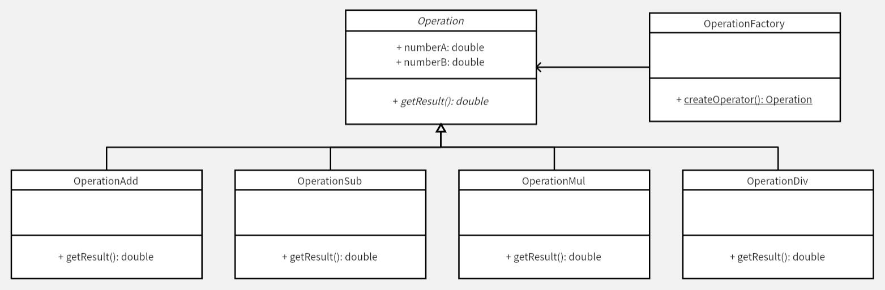

# 简单工厂模式
工厂负责生产产品，在本例中，运算类都具有 `getResult()` 方法，只是各个运算类的实现细节不同。使用简单工厂模式，对各个功能的实现可以独立开，互不干扰，而外部调用又可以统一在一起。

添加一个运算功能，只需要添加一个新的运算类，实现其计算功能，并在工厂中添加生成方法即可。删除一个运算功能只需要在工厂中删除生成方法，并删除该运算类即可。在编码的过程中，各个功能独立，互不影响，实现低耦合。

**示例功能：**
实现一个四则运算计算器，支持整型、浮点型之间的相互运算

**C++ Features：**
- [x] 智能指针
- [x] 模板类型推导
- [x] 静态断言限制类型推导
- [x] 异常

**UML 图：**

