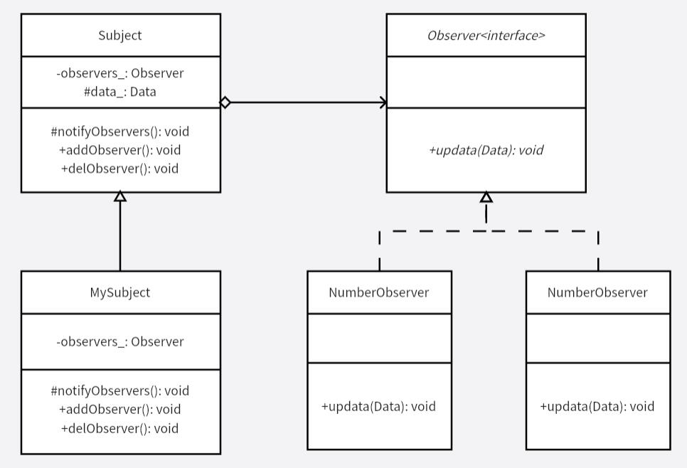

# 观察者模式
观察者模式也叫做发布-订阅模式，实际上是被观察者发生改变时，「通知」观察者，而非是观察者「观察」到改变。许多框架中都有的监听功能，即观察者。使用时需要对组件注册监听者，以及定义监听事件发生后的反应动作（回调事件）。

观察者模式适用于一个类发生改变时要通知其他类进行相应的操作，同时它还不知道其他类有多少个。

>要注意被观察者使观察者做出响应，而观察者又调用被观察者的某个功能，又反过来使观察者做出响应，造成死循环。

**示例功能：**
监听一个对象的数据变化

**UML 图：**

