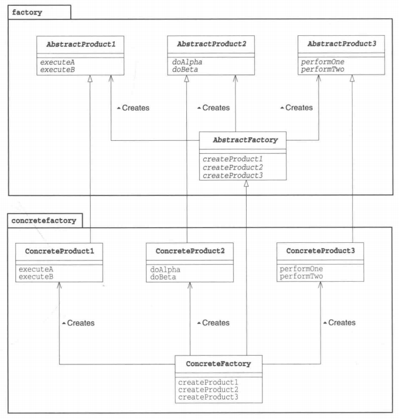

# 抽象工厂模式
一个抽象工厂定义了生产各种产品的接口，继承抽象工厂的具体工厂又定义了其各自的生产细节，生产出具体的产品（通过抽象产品统一，虽然具体产品不同，但是接口都是抽象产品）

这样，增加新的工厂，生产一个不同的具体产品（继承已存在的抽象产品），只要增加新工厂和新的具体产品，实现其生产流程和具体功能即可，不会对其他已完成的类和功能造成影响，满足开闭原则。但缺点是，如果需要添加一个新的抽象产品（抽象工厂中新增接口），则需要所有工厂都实现该接口。

同时，用户也不需要知道具体的产品细节，只需要知道某个抽象产品的功能接口即可。在此基础上，可以再套用一层简单工厂模式，使客户也不用知道具体工厂的细节，都使用抽象接口，减轻用户负担。

**示例功能：**
用不同的数据库实现增删改查（模拟）

**UML 图：**

