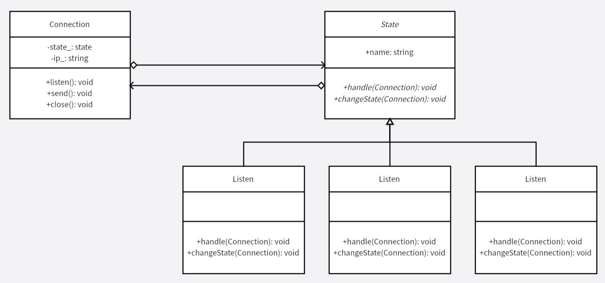

# 抽象工厂模式
对于不同的条件有不同的处理，定义为不同的状态，封装在状态内，这样在非常多的状态时，就不用大量的 `if-else` 来实现，也便于排查错误。避开大量的 `if-else`，将不同条件下的处理整合到类中，也易于增加新的状态。

实质上就是将各种状态转移逻辑分布在 `State` 的各个子类当中，虽然增加了系统的类数量，但是减少了各个状态间的依赖，容易进行拓展和维护。

**示例功能：**
实现 TCP 协议连接过程（简化）

**UML 图：**

