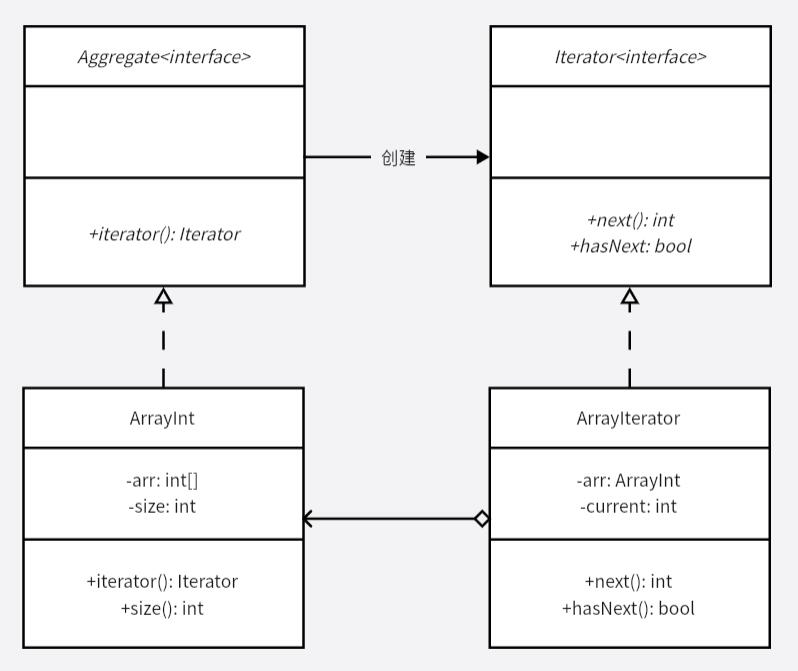

# 迭代器模式
一个集合，如果需要遍历，就可以使用迭代器模式。为这个集合对象提供开始位置、下一个、结束位置等等接口，例如 STL 中的容器就大量使用了迭代器模式。使用迭代器模式可以忽略底层存储结构，不论是顺序还是非顺序存储，在上层调用上都能保持一致，方便了使用者。

对外暴露的接口是 Iterator，即使内部的数据结构发生更改，集合遍历形式发生改变，也不需要更改上层应用代码，遍历结构只依赖于 Iterator。

**示例功能：**
实现文件目录树的打印

**UML 图：**

