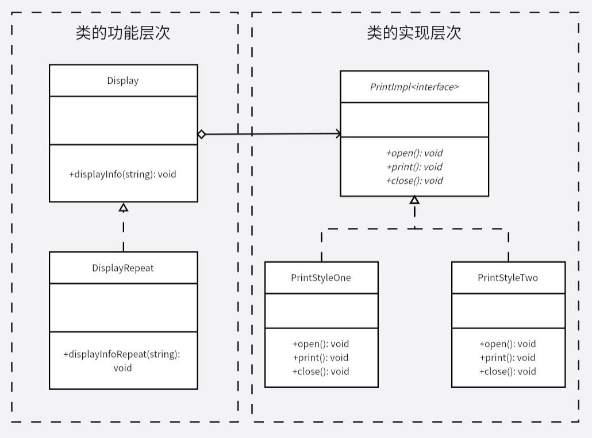

# 桥接模式
一个类通过委托的方式，将自身要实现的功能交付给 `Implementor` 这个抽象类，而这个抽象类的具体实现由子类确定，功能的拓展通过继承进行。

将功能的具体实现独立出来，委托给一个专门的功能接口，而自身仅进行流程的定义，这样在功能拓展或是功能修改时，可以很方便地进行。

简单来说，桥接模式提供了另一种除了继承外的拓展功能的方式，桥接模式通过聚合来拓展功能，而不是继承。

桥接模式通过将层次结构分为功能层次结构和实现层次结构来进行解耦。

>这里功能的意思有点类似于接口，他本身比接口多了一些实现细节（流程），但具体的工作还是交由实现层次结构实现，本例中 `Display` 的真正工作仍然是交给 `PrintImpl` 接口做，也就做到了流程不用管细节到底怎么做，细节也不用管流程到底怎么走，各自做好各自的工作即可。

**示例功能：**
实现一个易拓展的打印功能。

**UML 图：**

