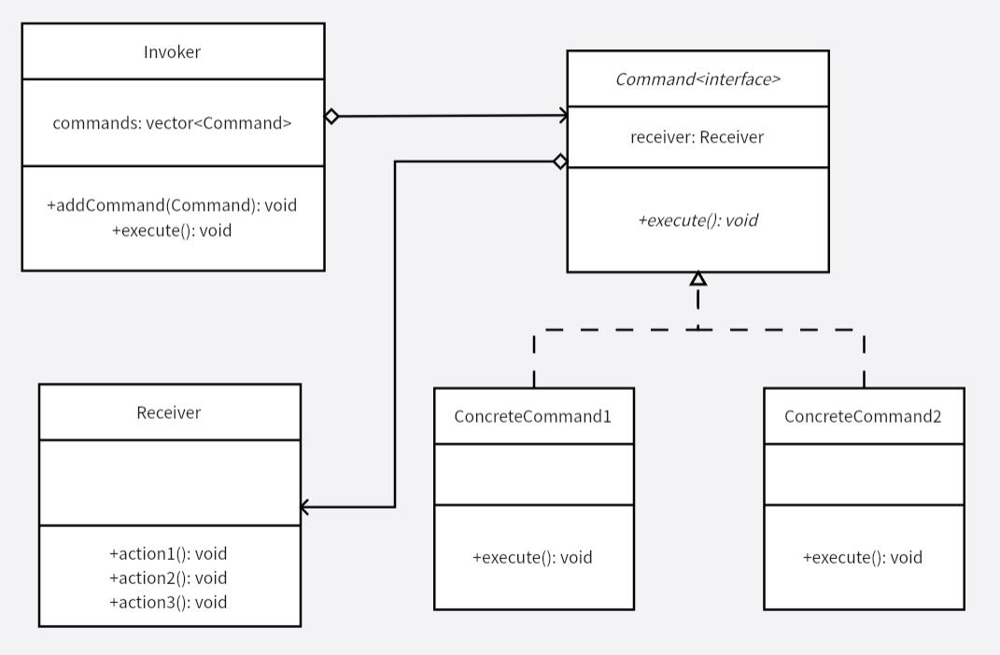

# 命令模式
命令模式的好处：可以比较容易地设计一个命令队列，可以将命令记入日志，接受方和请求方都可以决定该命令是否真的要执行，可以进行撤销和重做的操作。

命令模式将具体实现和流程控制进行解耦，即 `Command` 具体实现不用知道 `Receiver` 的功能细节怎么实现，`Receiver` 也不用知道 `Command` 中的流程如何定义。

由于具体命令类实现 `Command` 接口，增加新的命令只需要增加新的类，满足开闭原则。

**示例功能：**
实现一个命令队列。

**UML 图：**

