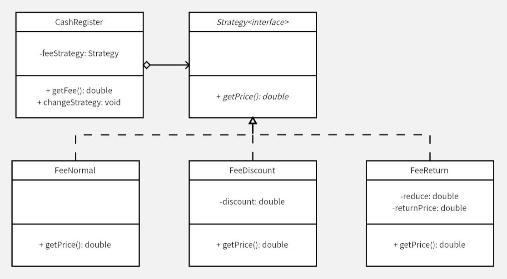

# 策略模式
将 `Strategy` 聚合到 `CashRegister` 中，避免使用大量的 `if else` 进行判断，同时各部分算法也进行了独立，互不影响，调整一种折扣算法或者新增、删除一种折扣算法，都不会影响到其他算法，实现了低耦合。

使用策略模式对算法进行了封装，对于一组算法，每个算法都有不同的特点，实现不同的功能或性能及稳定性不同，在运行时可以动态地选择执行哪一种算法进行处理，而不用修改源程序。

**示例功能：**
实现价格计算，计算原价进行折扣后的价格。三种折扣策略：原价、打折、满减。

**UML 图：**

