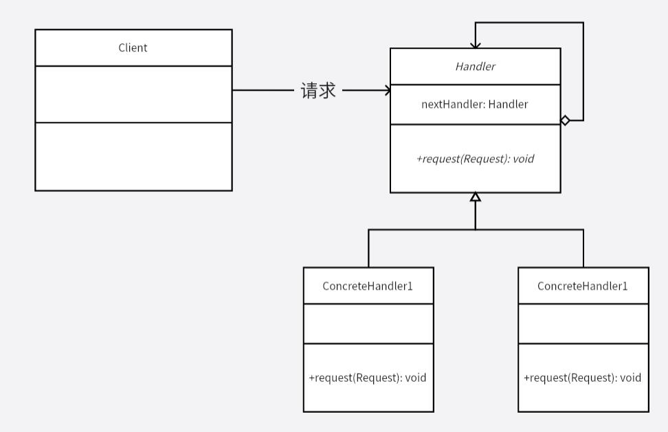

# 职责链模式
将请求方和处理方分离开，请求方不知道处理方到底如何处理，处理方也不知道请求方的具体信息（通过某些信息判断自己能否处理，其他信息都忽视），这样就使请求处理进行解耦。

而形成一个职责链之后，每个职责对象只需要维护自己职责范围内的功能，而不需要管其他职责的处理，这样各个职责功能又进行了解耦，不用对一个请求进行大量的 `if-else` 来判断到底该给哪一个功能负责。

同时，增加一个新的职责在职责链中也非常方便，但需要注意职责链的合理串联，产生环或者顺序不合理或者没有任何一个职责能够处理某种请求，会导致相应的问题。

**示例功能：**
实现一个请求处理的职责链。

**UML 图：**

