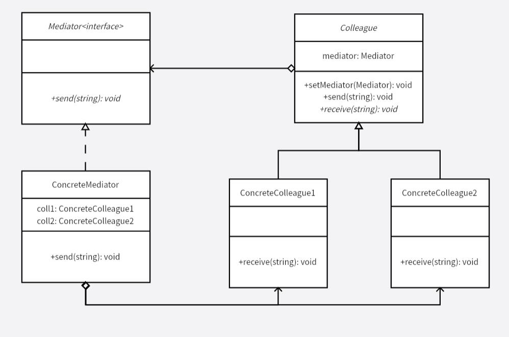

# 中介者模式
通过中介者模式屏蔽组件间的通信，从中心掌管组件间的通信，所有组件的通信都要通过中介者进行。从而解除类之间的直接交互，进行解耦，让类可以独立地调整自身而不需要考虑其他类，满足了迪米特法则。

如果组件间互相通信，例如一个组件的功能或状态依赖于其他两个组件的信息，而这两个组件又依赖于其他组件。这样一个组件取决于其他各个组件，且代码分散在各个组件中，会导致维护困难。

于是使用中介者模式，对组件间复杂混乱的通信做统一管理，组件只负责实现自身的功能，而决定功能调用则由中心指挥官来进行，即使功能调用出现某些问题，也只在中介者中。

**示例功能：**
实现一个中介者代替两个类之间的交流。

**UML 图：**

