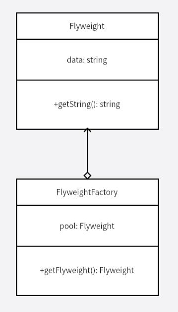

# 享元模式
对于需要重复使用的实例，在不同的地方如果需要不断生成使用，则开销较大，可以将这些实例保存在一个管理类中，所有使用向管理类索要。管理类会保存已经生成的那些实例，可以减小重复生成同一个实例的开销。

可以看作是一种功能更强大的单例模式，其中有一个工厂负责这些实例的生成，当用户索要实例，如果不存在则进行生成，存在则直接返回。

享元模式的目的是共享细粒度对象，是对象池的一种实现。

**示例功能：**
实现一个缓存字体数据的对象池。

**UML 图：**

