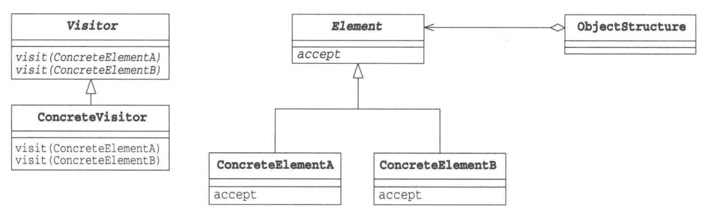

# 访问者模式
访问者模式适用于作用于某种对象结构上的各元素的操作方式，可以使我们在不改变的元素结构的前提下，定义作用于元素的新操作。将处理与数据结构的实现分离出来。

在该例中，如果需要增加一种新的访问方式，例如只需要字符串单数位的字符，只需要添加一个新的 `Visitor` 类，而不用修改原有的代码，满足开闭原则。

但缺点是需要数据结构不变，如果需要添加一个新的数据结构，例如 `double`，则需要在 `Visitor` 接口中定义访问 `double` 的接口，也就导致要在所有实现类中定义，不方便。当然也可以在 `Visitor` 中定义默认实现，未定义的实现类执行默认实现。

**示例功能：**
一个容器中包含字符串和整型，实现一个类，能够单独遍历字符串或整型。

**UML 图：**

