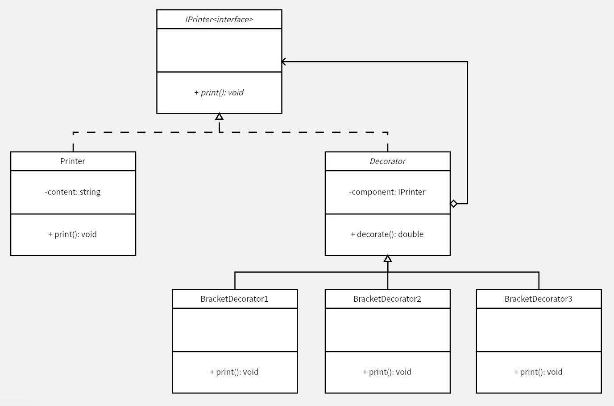

# Decorator 模式
Decorator 模式通过聚合给对象增加一些额外的职责（功能），通过继承也能够实现类似的功能，但相较继承更灵活，可以在不创建子类的情况下动态地拓展功能。

在本例中，要装饰输出文本（满足开闭原则的前提下），可以通过继承父类，然后重写父类方法来实现。但如果装饰方式非常多，那就要写非常多的子类，甚至如果装饰方式间存在组合（互相嵌套，例如本例中的组合装饰），那子类就更加无穷无尽了。

通过 Decorator 模式，将各个拓展功能分离开，选择需要的对原始类进行拓展，实现对应的拓展功能。功能分离的情况下，也更容易排查错误，每个功能只专注于自己的任务。

另一方面，在原有的功能上进行功能拓展，这些拓展通常是「装饰」原有的核心功能或主要行为，例如一些新的字段、新的方法。这些东西一般是为了满足某种特定情况下的需求，通过 Decorator 模式，将主要功能和拓展功能区分开，在一定程度上也可以防止主类为了考虑一些边角情况而变得过于复杂。

**示例功能：**
对要输出的文本，实现不同的装饰效果

**C++ Features：**
- [x] 智能指针
- [x] 异常

**UML 图：**

