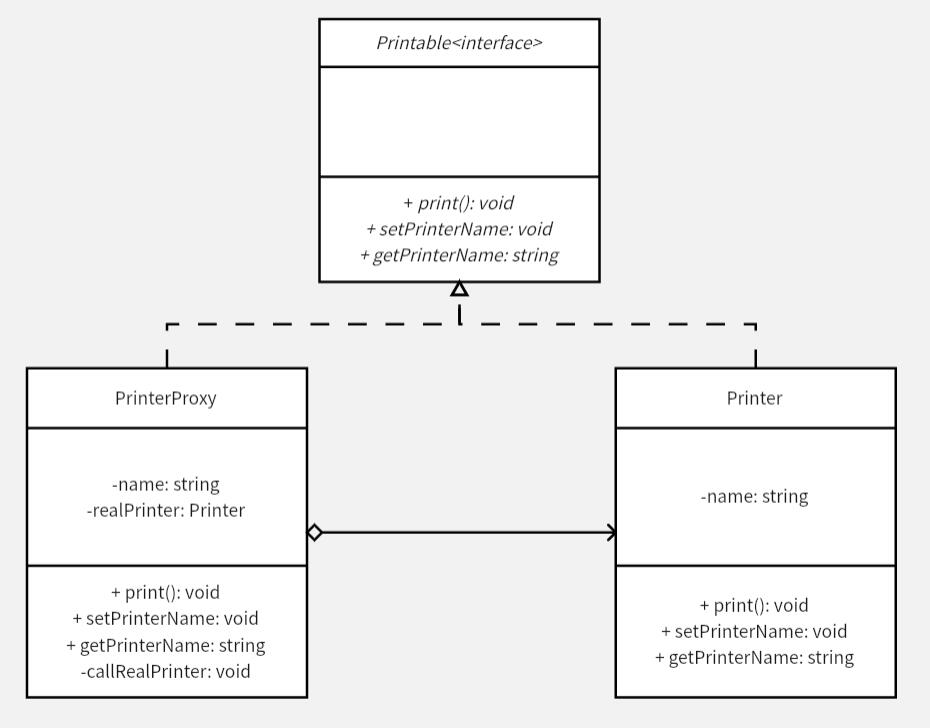

# 代理模式
对于那些实例化需要巨大开销的类来说，某些轻量级的工作，如设置一些固定的信息，就交由 `Proxy` 来完成。当需要进行实际的核心工作时，`Proxy` 会将这些轻量级的工作信息也一同上报给 `RealSubjec`t（先进行初始化，本例中是 `Printer` 类），然后再调用 `RealSubject` 相应的方法。

本例中，假设实例化 `Printer` 需要 5 秒，是一个开销巨大的操作。如果进行简单的对象设置，如获取名字、设置名字就开始实例化对象，程序对外表现就好像卡住了（单线程），但也许之后用户并不会真正使用到这些核心功能。使用代理模式，将对象实例化延迟到真正需要使用到核心功能时，一定程度上也能优化用户体验，更重要的是能够合理的利用系统资源。

另一方面，也可以通过代理进行权限限制，只允许一部分操作通过代理请求 `RealSubject`，这样就不用在 `RealSubject` 上设置复杂的权限限制。

**示例功能：**
通过 `Proxy` 请求 `RealSubject` 的方式对文本进行打印

**UML 图：**

