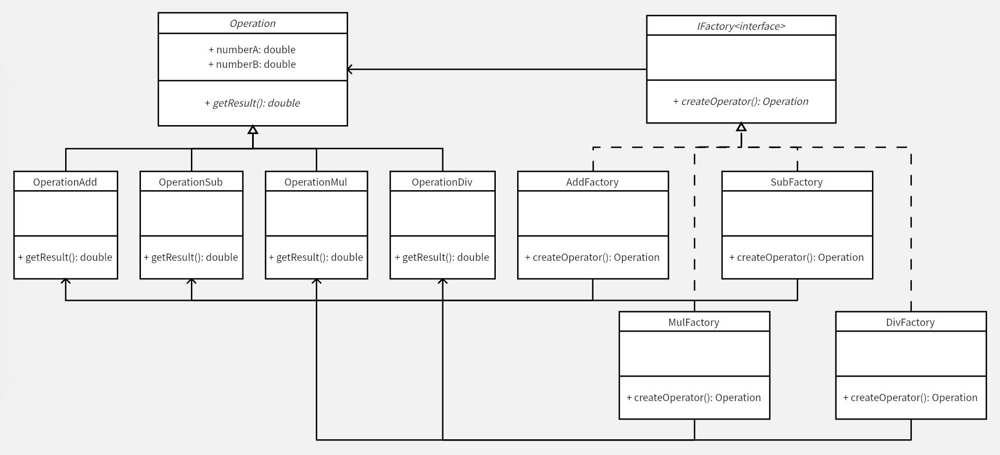

# 工厂模式
本例在简单工厂模式的基础上增加了工厂的抽象。在简单工厂模式中，增加一个新的产品（运算符），需要修改工厂的生产方法，在 switch 中添加一个分支，这就违背了开闭原则。

通过工厂模式，对工厂也进行了抽象，工厂都要继承生产产品的接口。这样就可以满足开闭原则，添加一个新的运算符，不需要修改原有的类，只需要添加一个新的工厂，它负责生产新的运算符的类实例。各个功能独立，互不影响，实现低耦合。

**示例功能：**
实现一个四则运算计算器

**C++ Features：**
- [x] 智能指针
- [x] 异常

**UML 图：**

