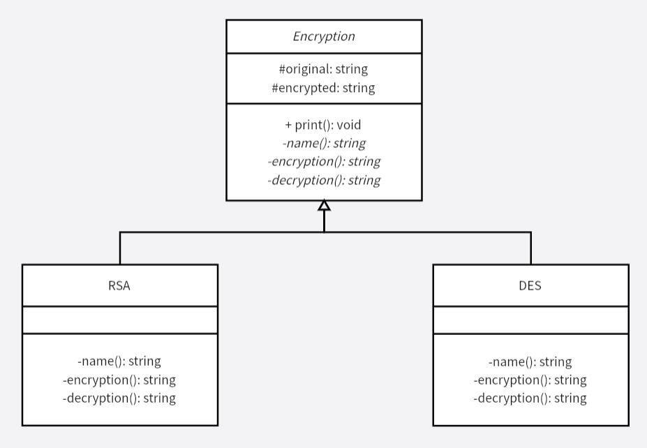

# 模板方法模式
本例在 `Encryption` 中定义了加密流程，也就是定义一个操作中的算法骨架，而将一些具体细节延迟到子类中。对于一些算法流程一致，但是某些细节不同的操作时，可以保证算法骨架不被改变。在子类不改变算法的结构时，可以重定义某些特定的算法细节和步骤。

避免了复制粘贴算法，然后再自行修改算法的细节，手动的复制粘贴修改是很有可能出错的，通过该设计模式，很好地解决了这个问题。

>本例中的加密算法仅做演示，并不是真实的加密算法。

**示例功能：**
实现一个文本加密和解密功能

**UML 图：**

