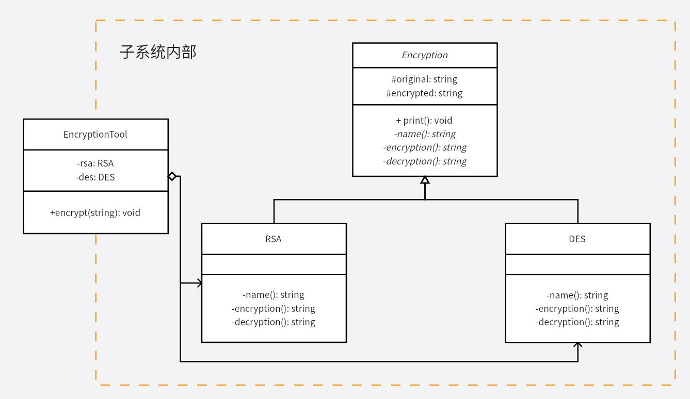

# 外观模式
通过外观模式将聚合的复杂功能在内部进行整合，对外提供一个高度集成的接口，用户无需知道内部复杂的流程。实现 API 的缩减，让复杂的东西看起来简单。

同时也实现了子系统与用户之间的松耦合关系，这使得子系统的组件变化不会影响到调用它的用户，只需要调整外观类即可。否则子系统进行修改，同时要在大量地方修改用户代码，使得维护修改的难度上升。

在本例中，用户没有必要知道加解密实现具体的类或实现的细节，仅仅只需要调用功能的接口，通过外观模式将功能集成到类 `EncryptionTool` 中，减轻用户的负担。

>本例中的加密算法仅做演示，并不是真实的加密算法。

**示例功能：**
实现一个文本加密和解密功能的类

**UML 图：**

