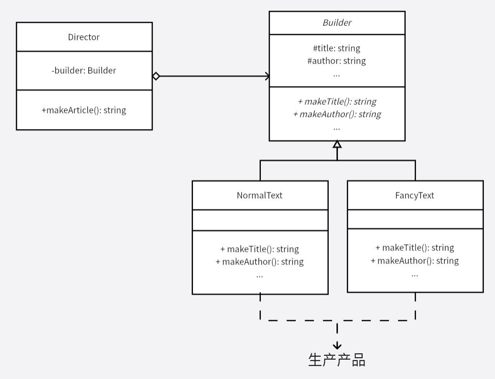

# 建造者模式
不同的建造者 -> 交由统一的管理类 -> 生产出不同的产品。

核心在于流程交由统一的类管理，避开繁琐易错的生产细节。

建造者模式是一步一步创建一个复杂的对象，用户不需要知道具体构建细节，产品交由 `Director` 构建，本例中产品为字符串。`Director` 类的作用主要有两个：一方面它隔离了客户与生产过程；另一方面它负责控制产品的生成过程。

对于流程相似，细节不同的算法或功能，就可以使用建造者模式进行管理，对流程进行统一规范和管理。

**示例功能：**
实现一个文档编写工具

**UML 图：**

